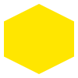
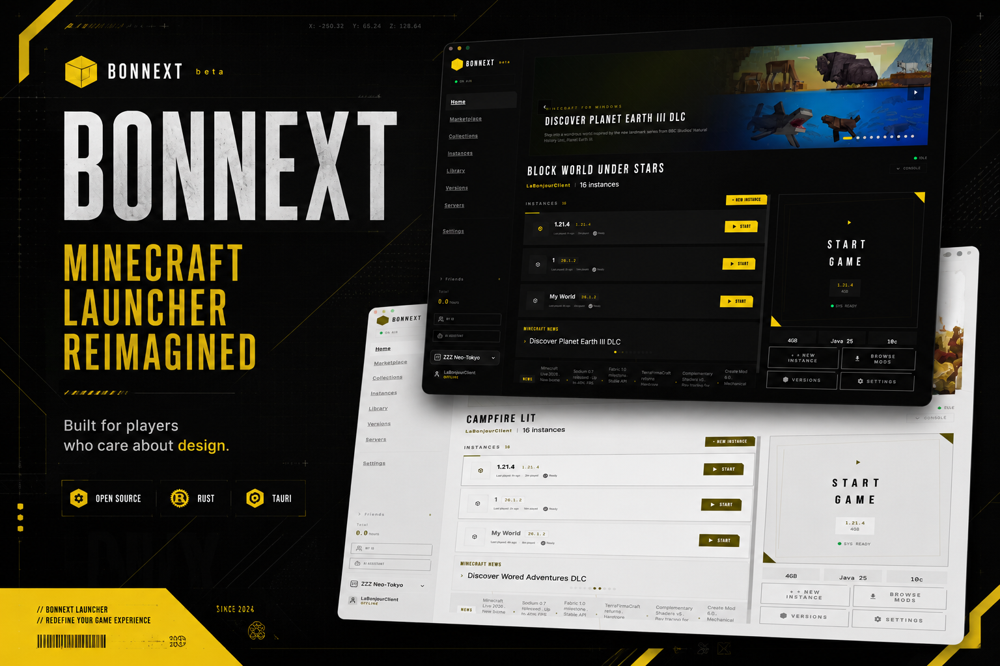
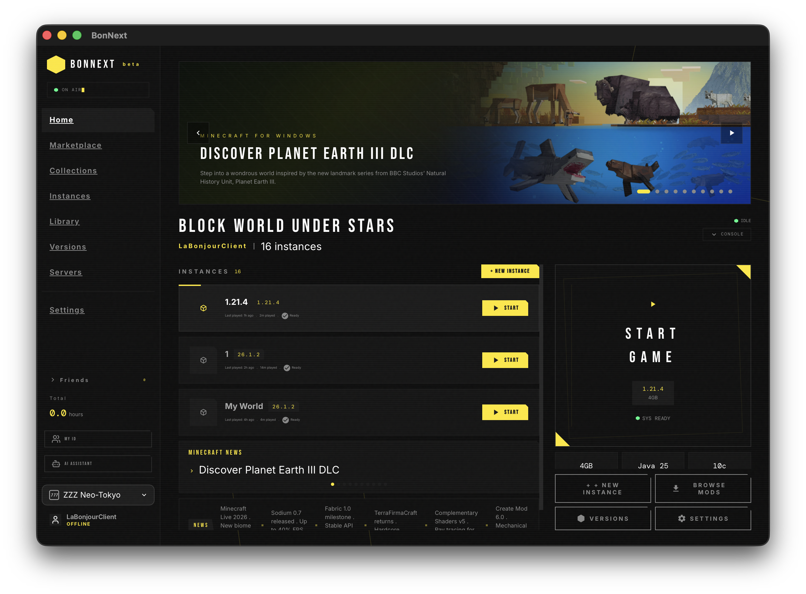
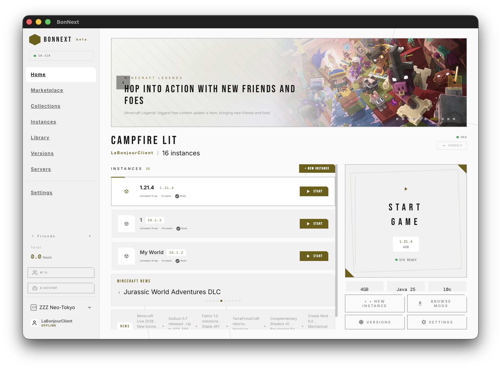

 
 

 

# BonNext

## Not a launcher. An entrance.

_A game interface for Minecraft — designed like a AAA title, not a utility._

 

 

[Download](#) &nbsp;&nbsp;·&nbsp;&nbsp; [Screenshots](#) &nbsp;&nbsp;·&nbsp;&nbsp; [Documentation](#) &nbsp;&nbsp;·&nbsp;&nbsp; [Join Discord](#)

 
 

> _"Minecraft has never looked this good."_

 
 

---

 

## Why BonNext

Most launchers feel like they were built to pass a pull request review. BonNext was built to be opened.

The question we asked wasn't "What features should a launcher have?" — it was **"What should launching Minecraft feel like?"**

Every pixel is placed with intent. Every transition is authored, not generated. Everything you touch responds with the weight and precision of a premium creative tool. Because the moment you open BonNext, you're already playing.

The launcher _is_ the game. We just made sure you can feel it.

 

---

 

## Design Language

 

### `#FFE600` — Electric Yellow. One color. One meaning.

This is the only accent in the entire system. It marks primary actions. It signals focus. It carries the brand. When you see it, you know something matters. In a sea of dark surfaces, yellow is the signal. Yellow is the voltage.

### Hard edges. Uncompromising.

Cards are clipped at angles. Buttons land like switch panels. Every surface reads like a HUD overlay on a triple-A title — precise, angular, arresting. The interface doesn't soften for you. It meets you at eye level, with the clarity of a cockpit instrument.

### Born dark.

True black canvas. OLED native. Layers lift out of the void with depth and precision — like instrument panels on a night flight deck. There is no "light mode" compromise. Darkness is the baseline.

### Noise. Scanline grain.

A structured noise texture sits across the viewport. Scanlines hum at threshold visibility. It's barely there — but without it, the interface would feel synthetic. With it, the screen has _material_. Digital becomes tangible.

### Motion that breathes.

Page transitions don't cut — they glide. Elements don't appear — they arrive. Every hover, every loading state, every shimmer is choreographed with purpose. When nothing moves randomly, everything feels deliberate.

 

> **This is not "gamer aesthetic."**  
> **This is industrial design, for software.**

 

---

 

## Features

_Experiences, not checkboxes._

 

|                                    |                                                                                                                                                 |
| ---------------------------------- | ----------------------------------------------------------------------------------------------------------------------------------------------- |
| **One launcher. Infinite worlds.** | Isolated instances with shared libraries. Clone entire setups in one click. Snapshots. Imports. Exports. Your worlds, your way.                 |
| **Click. Play. No waiting.**       | Downloads happen in parallel, verifying integrity automatically. Mirrors fall back silently. The only thing you notice is how fast it is.       |
| **Sign in. Stay in.**              | Microsoft OAuth with silent token refresh. Offline accounts with your own UUID. Switch between them like browser tabs — no logout, no friction. |
| **Every mod, one click away.**     | Browse Modrinth and CurseForge from inside the launcher. Dependencies resolve themselves. One click installs everything.                        |
| **Watch the engine run.**          | Real-time launch state streaming from the Rust core — no polling, no spinners. See every stage as it happens.                                   |
| **Your status. Your squad.**       | Discord Rich Presence updates automatically. Friends see what you're playing the moment you launch.                                             |

 

---

 

## Built with

| Layer     | Technology                                          |
| --------- | --------------------------------------------------- |
| Shell     | **Tauri 2** · 20x slimmer than Electron             |
| Engine    | **Rust** · Async, zero-cost, fearless               |
| Interface | **React 18** · TypeScript · CSS Modules             |
| Motion    | **framer-motion** · Every transition, choreographed |
| Identity  | Custom tokens · Hard-edge geometry · `#FFE600`      |

 

---

 

## Screenshots

 

 

---

 

## Roadmap

_Where we're headed. Not what we're building — what you'll be playing with._

| Now                             | Next                                         | Future                                     |
| ------------------------------- | -------------------------------------------- | ------------------------------------------ |
| Core engine, solid as steel     | Theme marketplace · build your own aesthetic | Cloud profiles · sync your worlds anywhere |
| Instance ecosystem              | Modpack creator · drag, drop, publish        | AI companion · a friend inside the game    |
| Modrinth + CurseForge browsers  | Plugin system · extend everything            | Cross-device · desktop to mobile, seamless |
| Dual auth · Microsoft + offline | Achievement tiers · earn your stripes        | Real-time co-op · worlds with friends      |
| Discord Rich Presence           | Crash forensics · one-click diagnosis        | Voice overlay · talk without leaving       |
| Windows · macOS · Linux         | Steam Deck ready                             | Mobile companion app                       |

 

---

 

## Philosophy

> **A great launcher gets out of your way.**

Three rules we don't break:

**Feel it before you ship it.** If a transition stutters, if a button lands wrong, if a color feels off — it doesn't go out. Metrics and analytics inform decisions. But the final verdict is always: _how does it feel?_

**Design is not a coat of paint.** We don't "add UI" to a working system. Every interaction is designed in parallel with the logic behind it. The interface and the engine speak the same language.

**Minecraft begins at the launcher.** The browsing. The anticipation. The preparation. The moment you decide what to play, you're already inside the experience. We design for that whole journey — not just the login screen.

 

---

 

## Contributing

We build BonNext in the open and welcome contributions that share our obsession with craft.

We're looking for help with bug fixes, platform polish, accessibility, localization, and UI refinement.

**Design is our core differentiator.** Major features without prior discussion won't be merged. Open an issue. Let's talk first.

 

---

 

## License

**GNU General Public License v3.0** — free to use, study, modify, and redistribute.

The BonNext name, logo, and visual identity are proprietary. Commercial redistribution under the same branding requires explicit permission.

See [LICENSE](LICENSE).

 

---

 

 

## ★

### Star this repo if you believe

### Minecraft deserves a launcher

### that feels like a game.

 

 
 

> _"Open it. You'll understand."_

 
 

<picture>
  <source media="(prefers-color-scheme: dark)" srcset="https://capsule-render.vercel.app/api?type=waving&color=FFE600&height=120&section=footer&text=&fontSize=0&animation=fadeIn">
  
</picture>

